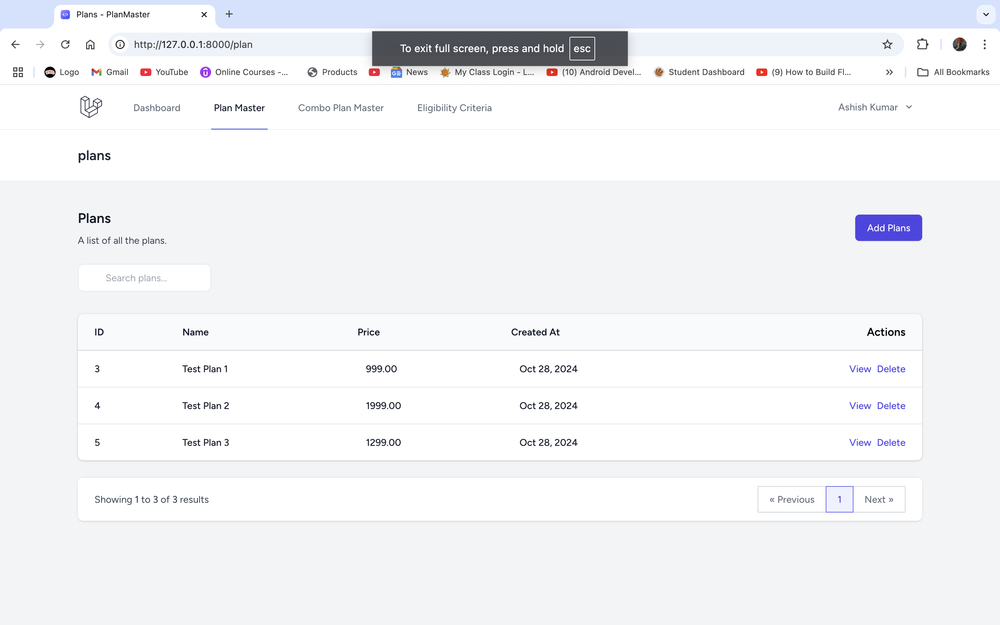
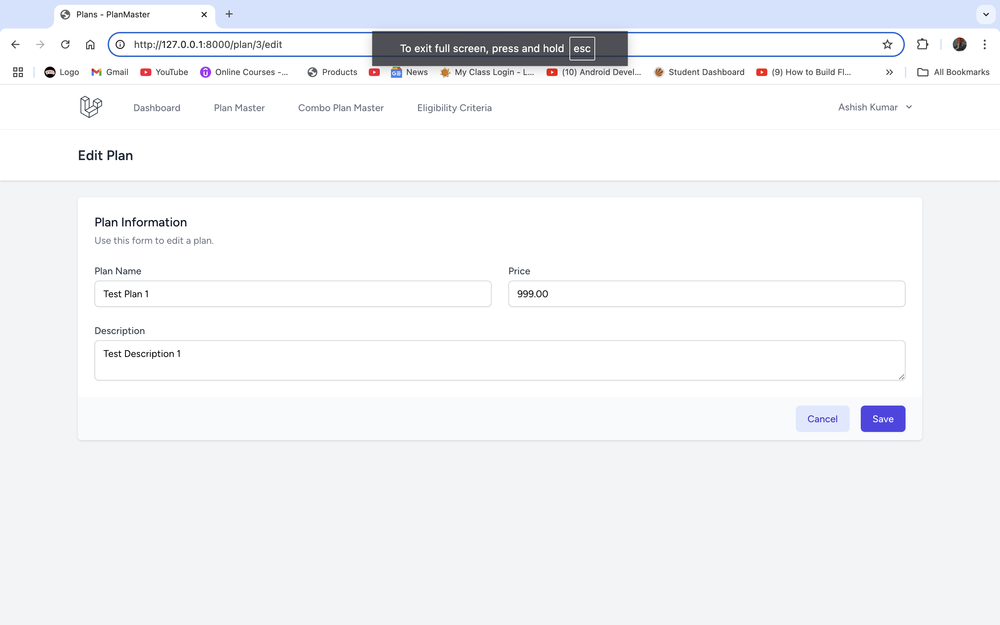
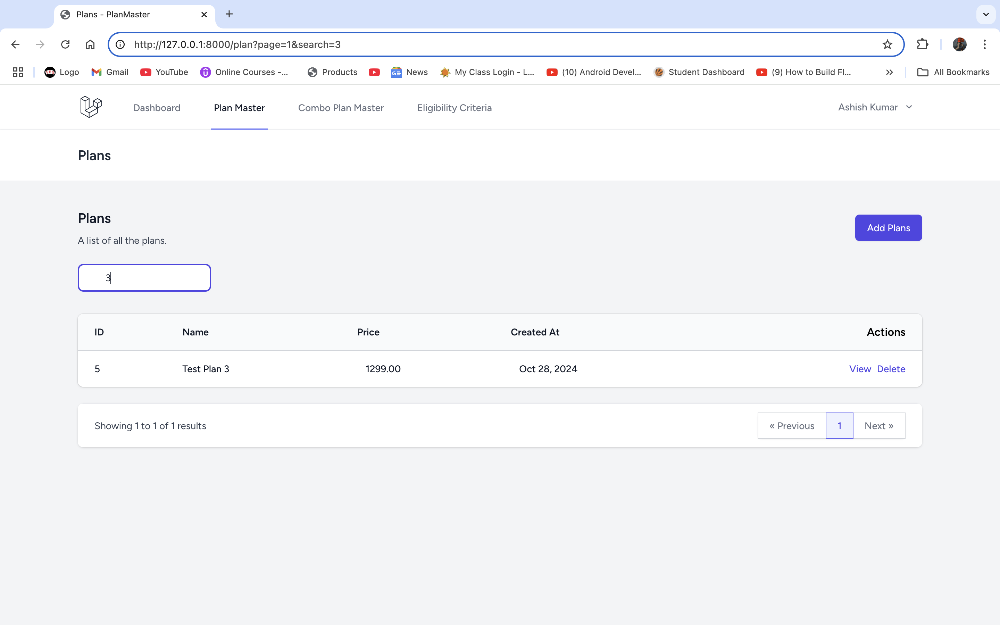
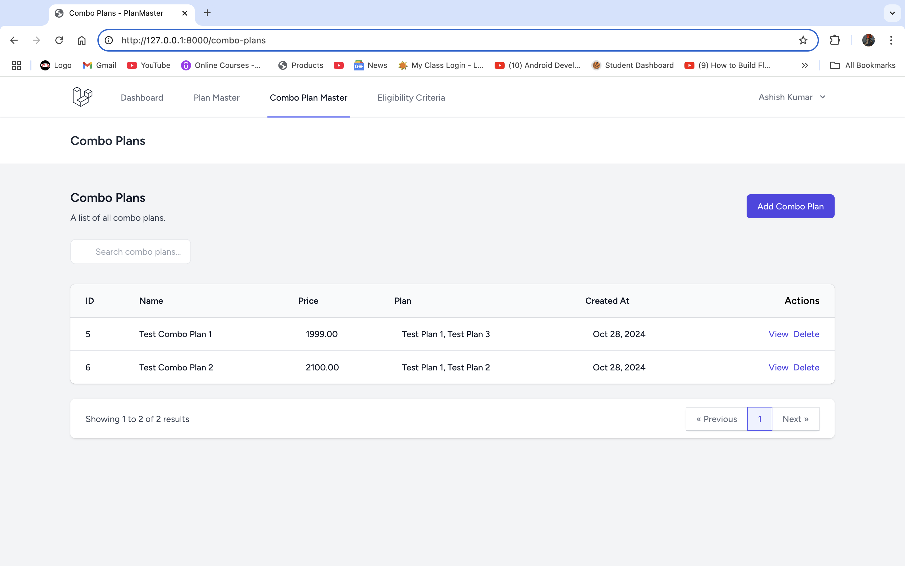

# PlanMaster

## Project Overview

PlanMaster is a comprehensive platform designed to manage and optimize subscription plans and eligibility criteria for users. The application allows users to create, edit, and manage various subscription plans, offering flexibility and enhanced user experience. 

## Table of Contents

- [Features](#features)
- [Screenshots](#screenshots)
- [Relationships](#relationships)

## Features

- **Plans**: Creating, Updating, and Deleting Plans with search filter and pagination.
- **Combo Plans**:  Creating, Updating, and Deleting Combo Plans with search filter and pagination.
- **Eligibility Criteria**:  Creating, Updating, and Deleting Eligibility Criteria with search and pagination.

## Screenshots

*List Plans*

*Manage Plans*

*Search Plans*

*List Combo Plans*

*Manage Combo Plans*

## Relationships

### Many To Many Relationship b/w Plans and ComboPlans.

- **Combo Plans**: A ComboPlan can have multiple Plan instances associated with it through the combo_plan_mappings table
- **Plans**: A Plan can belong to multiple ComboPlan instances via the combo_plan_mappings table.
